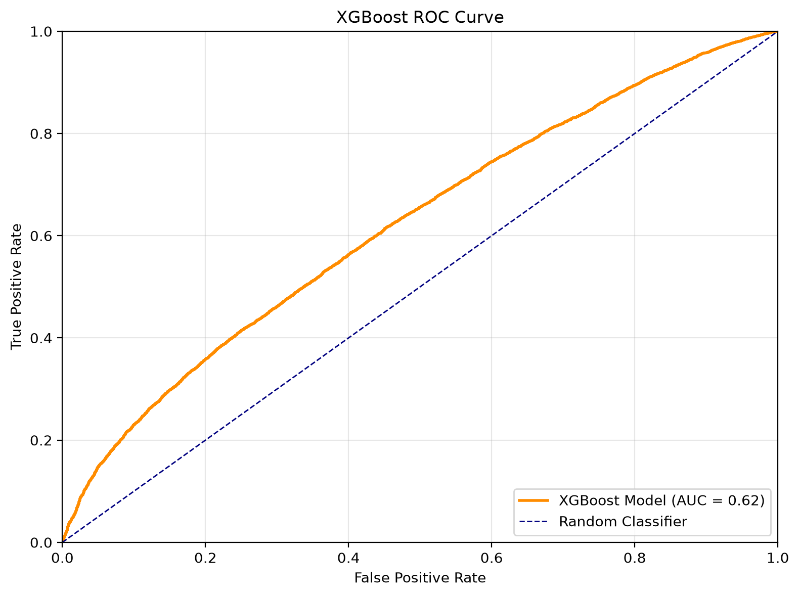
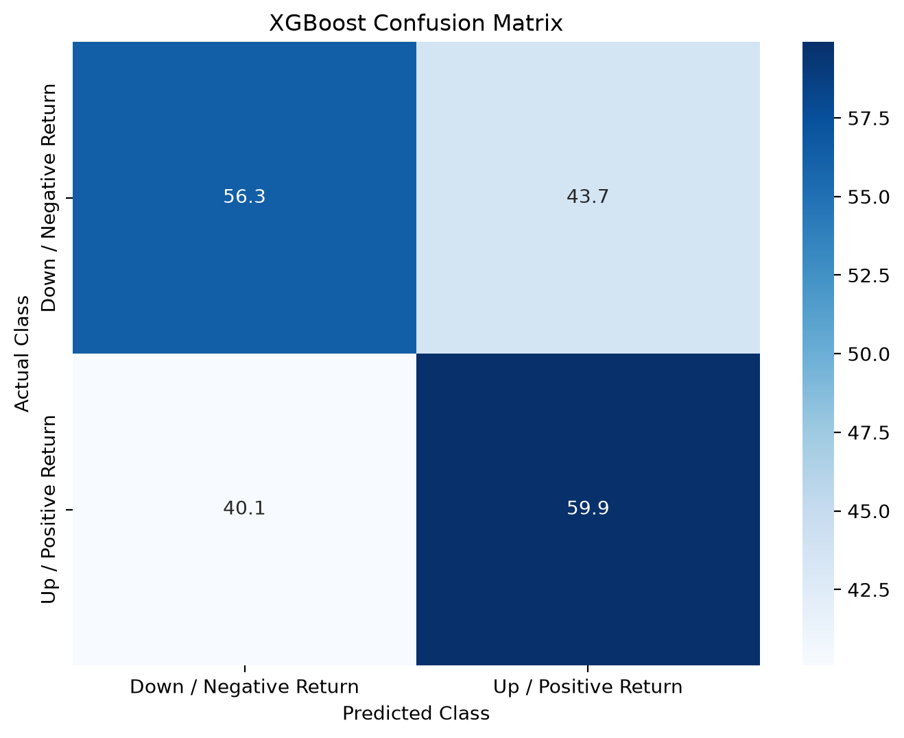

# Fundamental Machine Learning Long/Short Equity Strategy
### A machine learning research project that uses company fundamentals and price features to generate predictive buy/sell signals.

## Overview
This project tests whether lagged company fundamentals from 10-Q filings combined with features derived from historical prices can be used to generate machine learning signals for three-month stock returns.

Rather than attempting to forecast the entire market, the project frames the problem as a binary classification task: predicting whether an individual stock is more likely to rise or fall over the next three months. The current version focuses on evaluating the quality of these buy/sell classifications using model performance metrics.

Future work would extend these model outputs into a formal long/short portfolio backtest, where positive signals are used as long candidates and negative signals are used as short candidates. This would allow the strategy to be evaluated against the S&P 500 benchmark using portfolio returns, drawdowns, and risk-adjusted performance metrics.

## Research Question
Can machine learning models trained on lagged 10-Q fundamentals data and historical price features generate predictive buy/sell signals for three-month stock returns?

## Key Results
The best model so far is an XGBoost classifier. It predicts whether a stock's return over the next three months will be positive or negative based on lagged company fundamentals and historical price features.

  

  

- The model scored 0.62 on ROC-AUC, modestly better than randomly guessing.
- The confusion matrix shows it can pick out both positive and negative return cases, but it still gets a meaningful number wrong.
- These numbers only measure how good the classifier is at separating the two classes. They don't tell us how a long/short portfolio built on these predictions would actually perform
- Returns, drawdowns, and risk-adjusted metrics are still on the to-do list.

## Data
Raw and cleaned datasets are not included in this repository due to licensing, redistribution, and file-size considerations.

This project used four datasets:

1. Financial Filings (10-Q)  
   Source: [SEC](https://www.sec.gov/data-research/sec-markets-data/financial-statement-data-sets)  
   Description: Quarterly company fundamental data extracted from SEC 10-Q filings, including income statement, balance sheet, and cash flow statement fields used to construct model features.

2. Standard Industrial Classification Codes (SIC Codes)  
   Source: [SEC](https://www.sec.gov/search-filings/standard-industrial-classification-sic-code-list)  
   Description: Industry classification data used as a categorial feature in the modeling phase and may eventually be used as a filter for L/S stocks of the same industry.

3. Historical Stock Prices  
   Source: [Yahoo Finance](https://finance.yahoo.com/) using the [yFinance](https://pypi.org/project/yfinance/) package  
   Description: Historical price data used to create price-based features and the binary target variable indicating whether a stock rose or fell over the following three-month period.

4. Market Capitalization Data  
   Source: [Stock Analysis](https://stockanalysis.com/list/biggest-companies/)  
   Description: Company market capitalization data used to support filtering during data cleaning and feature engineering.

## Methodology

## Repository Structure

## Reproducing the Project
The reproducible pipeline uses two notebooks in `src/`:

1. `01_sec_fundamentals_master_creation.ipynb` builds the cleaned SEC fundamentals file from manually downloaded SEC quarterly ZIP files.
2. `02_full_project_report.ipynb` combines fundamentals with Yahoo Finance price data, creates the final modeling files, and runs the analysis, modeling, results, and conclusion.

Run the notebooks from the `src/` folder so the relative paths resolve correctly. Raw and cleaned data files are not committed to the repository, so see `data/README.md` for the required folder layout, manual downloads, and generated outputs.

## Technologies Used

## Limitations and Future Work
